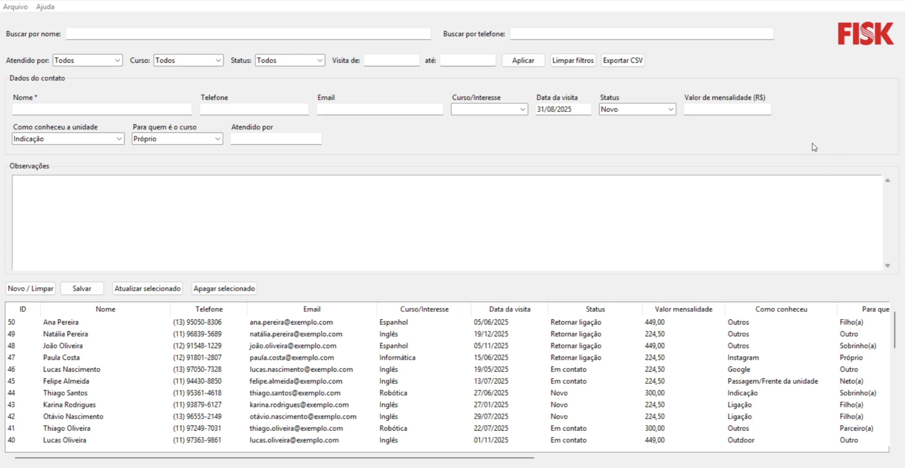
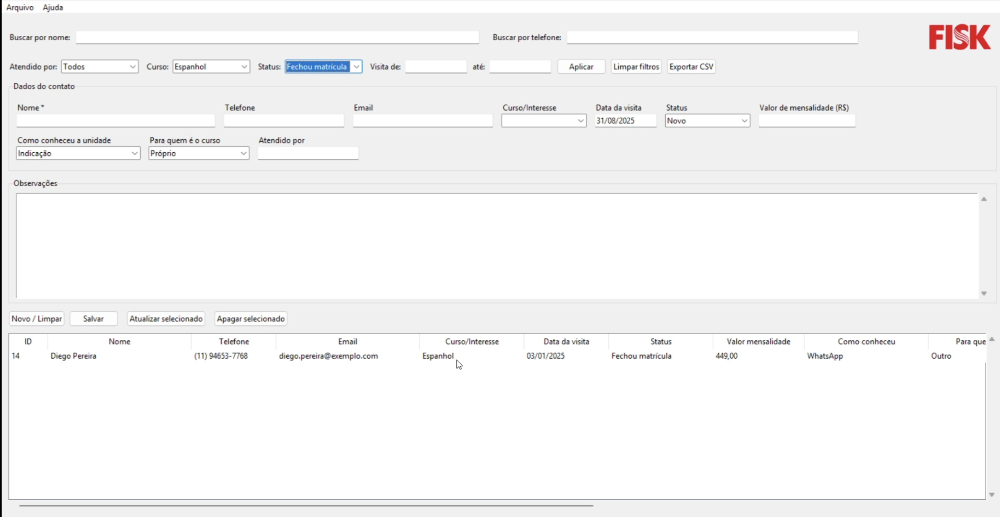

# Follow-up System 📊

Sistema local de **cadastro e follow-up de contatos** desenvolvido em **Python + Tkinter + SQLite**, com filtros avançados, autoformatação de dados e exportação para CSV.  

---

## 🛠️ Tecnologias utilizadas  

- **Python 3.x**  
- **Tkinter** → Interface gráfica (GUI)  
- **SQLite3** → Banco de dados local persistente  
- **CSV** → Exportação de relatórios  
- **Regex** → Validações e formatações (datas, telefones, valores)  

---

## ✨ Funcionalidades  

- Cadastro, edição e exclusão de contatos  
- Filtros por:
  - Nome  
  - Telefone (busca por qualquer sequência de dígitos, ignora formatação)  
  - Atendente  
  - Curso/Interesse  
  - Status  
  - Período de datas (Data da visita)  
- Autoformatação:  
  - **Datas** → usuário pode digitar `01012025` e o sistema converte para `01/01/2025`  
  - **Telefones** → usuário pode digitar `11987551220` e o sistema converte para `(11) 98755-1220`  
  - **Valores monetários** → normalização para padrão brasileiro `R$ 1.234,56`  
- Exportação para CSV respeitando todos os filtros aplicados  
- Interface amigável com barras de rolagem horizontal e vertical  
- Banco de dados SQLite criado automaticamente (`contacts.db`)  

---

## 📖 Contexto do Projeto  

Este sistema foi desenvolvido como uma **solução local (desktop)** para um centro de ensino que enfrentava **perdas de matrículas devido à desorganização no controle de leads em planilhas**.  

O objetivo foi criar uma ferramenta **robusta, intuitiva e de fácil instalação** para:
- Centralizar e agilizar o cadastro de contatos  
- Organizar o follow-up
- Buscar e acessar informações de forma simples e rápida
- Extrair dados estratégicos para tomada de decisão  

---

## 🖥️ Solução Técnica: Aplicação Desktop Robusta e Intuitiva  

Foi desenvolvida uma aplicação desktop utilizando **Python**, com a biblioteca nativa **Tkinter** para a interface gráfica e **SQLite** para o armazenamento de dados.  

Essa stack foi escolhida por criar uma solução **leve, de fácil instalação e que opera localmente**, sem dependência de internet ou servidores complexos.  

---

## 🔑 Funcionalidades Principais  

**Gestão Completa do Ciclo do Contato:**  
A aplicação oferece funcionalidades essenciais de CRUD (Cadastro, Edição e Exclusão) de contatos, permitindo um gerenciamento completo do pipeline de leads.  

**Filtros Avançados e Dinâmicos:**  
A principal força do sistema reside em sua capacidade de busca. Os usuários podem segmentar a base de dados com precisão, combinando filtros por:  
- Nome  
- Atendente  
- Curso de Interesse  
- Status  

**Busca inteligente por Telefone:**  
Permite encontrar um número por qualquer sequência de dígitos, ignorando formatações como `()` ou `-`.  

**Período de Datas:**  
Facilita a análise de leads que visitaram a unidade em intervalos específicos.  

**Entrada de Dados Inteligente (Autoformatação):**  
Para agilizar o cadastro e garantir a padronização das informações, o sistema aplica formatações automáticas em tempo real de forma inteligente:  
- Datas: `01012025` é convertido para `01/01/2025`  
- Telefones: `11987551220` é formatado como `(11) 98755-1220`  
- Valores Monetários: normalizados para o padrão brasileiro `R$ 1.234,56`  

**Exportação Estratégica para CSV:**  
Com um único clique, o usuário pode exportar a visualização atual para um arquivo CSV.  
A exportação é inteligente e respeita todos os filtros aplicados, permitindo a criação de relatórios segmentados para análise em outras ferramentas como Excel ou Google Sheets.  

**Banco de Dados Local e Portátil (SQLite):**  
Na primeira execução, o sistema cria automaticamente o arquivo `contacts.db`.  
Isso simplifica o backup e a portabilidade, eliminando a necessidade de um servidor de banco de dados complexo.  

**Interface Amigável:**  
A interface construída com Tkinter foi projetada para ser limpa, intuitiva e funcional, incluindo barras de rolagem horizontal e vertical para navegar com facilidade por grandes volumes de dados. Em poucos segundos e com pouquíssimos cliques o usuário pode criar um novo cadastro ou buscar por um em específico.

---

## 📊 Impacto  

A aplicação substituiu um processo **manual e suscetível a erros** por uma ferramenta **centralizada e eficiente**.  

- A capacidade de **filtrar**, **formatar dados automaticamente** e **exportar relatórios personalizados** deu à equipe comercial um **controle maior** sobre suas operações.  
- Resultados:  
  - Melhor organização
  - Otimização do processo de busca e cadastro 
  - Follow-ups mais eficazes  
  - Gestão baseada em dados
  - Redução de perdas de leads e aumento de matrículas  

---

## 📸 Demonstração (prints)  

### Tela principal  

  

### Filtros aplicados  

  

---

## Download do Executável
Devido ao limite de 25MB do GitHub, o executável não está hospedado no repositório.  
👉 Você pode baixar e testar a versão mais recente por este link:  **[Download do Executável]([https://seu-link-aqui.com](https://drive.google.com/file/d/14YXlIUK6iGhTqCXG7gpWl-3MkXyBpU3a/view?usp=sharing))**  

---

## 🚀 Instalação e uso  

Clone este repositório:  

```bash
git clone https://github.com/gustavochotti/follow-up-system.git
cd follow-up-system
```

Execute o sistema:  

```bash
python app.py
```

📌 O sistema abrirá em tela cheia com interface Tkinter.  

---

## ⚙️ Como Gerar seu Próprio Executável

Caso você queira compilar o sistema por conta própria, siga as instruções abaixo:

1. **Instale o PyInstaller**  
   Certifique-se de ter o Python instalado (3.10+ recomendado).  
   Depois, instale o PyInstaller:  

   ```bash
   pip install pyinstaller
   ```

2. **Compile o executável**  
   Na pasta do projeto, execute:  

   ```bash
   pyinstaller --onefile --noconsole app.py
   ```

   Onde `app.py` é o arquivo principal do sistema.

3. **Personalize o ícone (opcional)**  
   Caso queira incluir um ícone personalizado no executável, utilize o parâmetro `--icon`:  

   ```bash
   pyinstaller --onefile --noconsole --icon=app-icon.ico app.py
   ```

   > O arquivo `app-icon.ico` deve estar na mesma pasta do projeto.

4. **Logo da Interface**  
   Se quiser manter a logo da empresa visível na interface (como mostrado nos prints), certifique-se de deixar a imagem da logo (por exemplo, `background-logo.png`) **na mesma pasta do executável**.  

   Dessa forma, o programa conseguirá carregar a imagem corretamente.

5. **Personalizações adicionais**  
   - O **título da janela** do programa, a seção **"Sobre"** do menu e outros textos podem ser facilmente alterados diretamente no código-fonte.  
   - Basta abrir o arquivo `.py` em um editor de código e ajustar conforme desejar.

6. **Arquivos Gerados pelo PyInstaller**

    Após a compilação, o PyInstaller criará uma pasta chamada **`dist/`** e
    outra chamada **`build/`**:
    
    -   **dist/** → Contém o **executável final** (arquivo `.exe` no
        Windows). Este é o arquivo que você pode distribuir para os
        usuários.\
    -   **build/** → Contém arquivos temporários e de suporte usados durante
        a criação do executável (pode ser ignorada na distribuição).\
    -   **app.spec** → Arquivo de configuração gerado pelo PyInstaller que
        guarda as opções de build utilizadas (pode ser reutilizado em
        futuras compilações).
    
    O executável estará dentro da pasta **`dist/`**.\
    Exemplo: `dist/app.exe`

---

## 🔮 Possíveis evoluções (Roadmap)  

- [ ] Relatórios automáticos em **PDF/Excel** com estatísticas de conversão (pandas + matplotlib)  
- [ ] Dashboard analítico com **Streamlit** ou **Dash**  
- [ ] Modelo preditivo (scikit-learn) para prever **probabilidade de matrícula**  
- [ ] Integração com APIs de mensagens (WhatsApp/Email) para follow-up automático  

---

## 📄 Licença  

Este projeto foi desenvolvido para um cliente real, mas está publicado aqui com fins **educacionais e de portfólio**.  
Sinta-se à vontade para se inspirar e evoluir a solução.  
